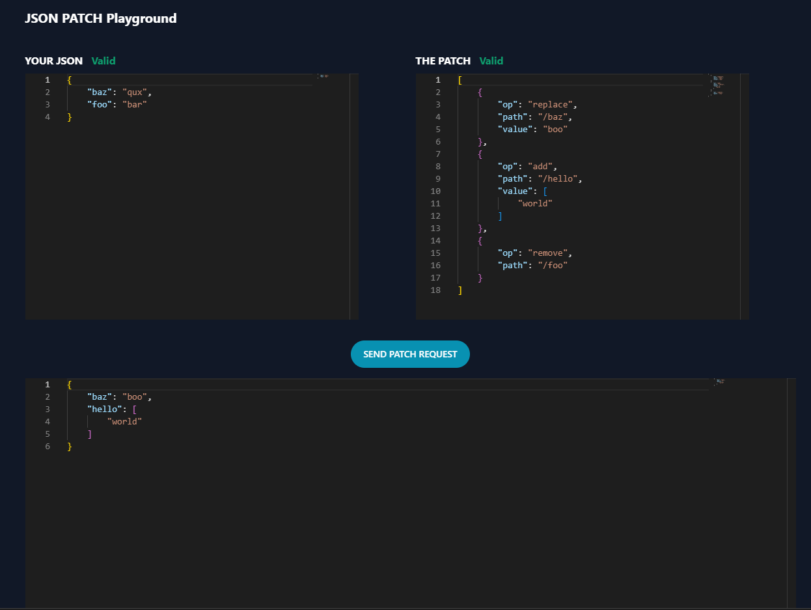

# json-patch-
Repository contains frontend and backend. 

## Backend
Nodejs microservice with two major functionalities:
- Authentication
- JSON patching: Takes json and json patch as input and returns patched json.

#### HOW TO RUN
```bash
cd backend
npm install 
npm start # or npm run dev
```

## Frontend
React with app with authentication flow and json patching flow (refer to screenshot below)



#### HOW TO RUN
```bash
cd frontend
npm install
npm dev
```


## Tests
All tests for authentication and json patching pass. 
They are located in `backend/tests`

#### HOW TO RUN
```bash
cd backend
npm test
```

